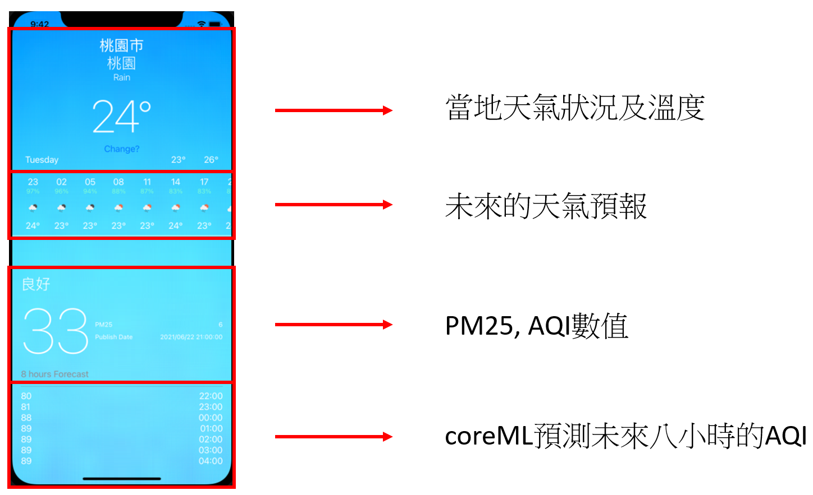
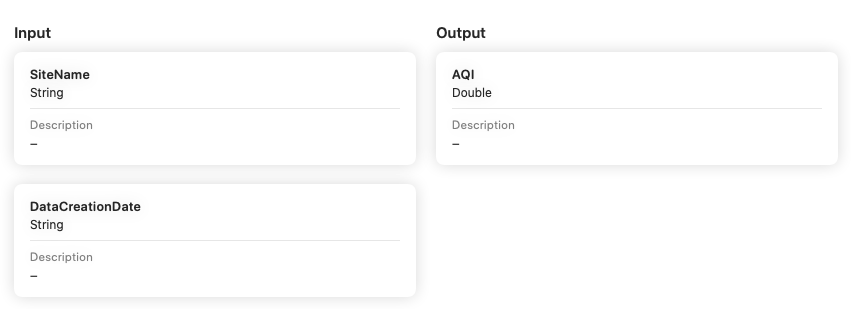

# AQI_Queryer_SwiftUI

## 109-2 IOS 期末專案
&emsp;

&emsp;
&emsp;

## 天氣即時資訊 (上半)

擷取了[iOS WeatherApp with SwiftUI](https://github.com/irmusyafa/ios-weatherapp-swiftui)的部分

[Openweather API](https://openweathermap.org/api)取得天氣的資訊

## AQI即時資訊 (下半)

資料來源: [政府資料開放平台
](https://data.gov.tw/dataset/40448
)

預測AQI的部分由coreML的tabular regression 訓練而成

